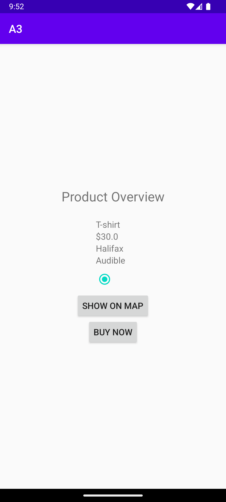
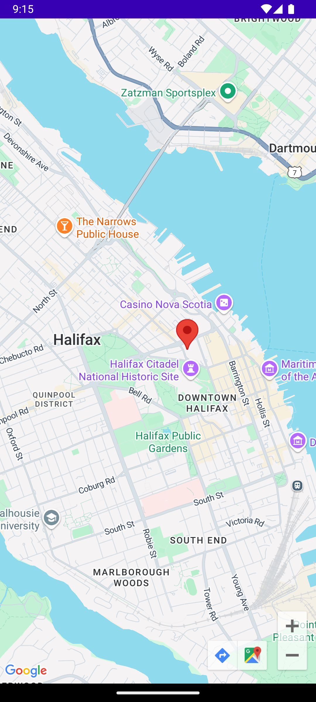
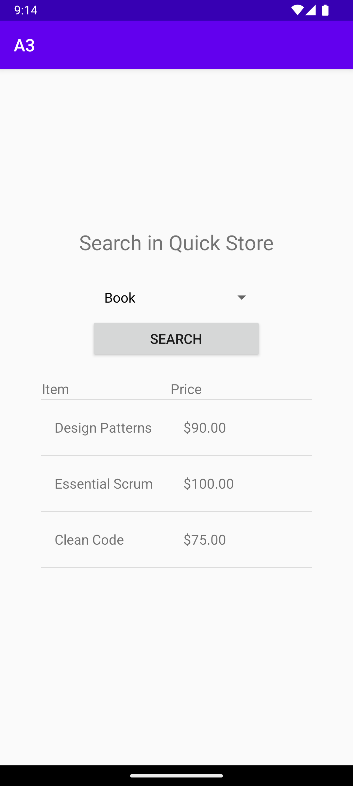

# 📚 QuickTutor - Educational & E-commerce Mobile App  

## 🚀 Overview  
QuickTutor is a mobile application that provides a **seamless blend of education and e-commerce** functionalities. Users can:  
✅ **Search for tutors** (students)  
✅ **Place ads for tutoring services** (tutors)  
✅ **Manage users & services** (admins)  
✅ **Search & purchase items from a store**  
✅ **Locate item locations via Google Maps**  

Developed by **Malhar Mahajan**, **3rd-year Computer Science Student**  

---

## 🏗️ Tech Stack  
- **Android Studio** (2024.2.1 Patch 3)  
- **Java** (Object-Oriented Programming)  
- **JUnit 4.13.2, Espresso 3.6.1, UIAutomator 2.3.0** (Testing)  
- **Mockito 3.4.0** (Mocking)  
- **Google Maps API** (Location Services)  

---

## 🔥 Features  

### 📌 Role-Based Access Control  
Each user has a different role and corresponding **permissions**:
- **Student:** Can search for tutors and shop.  
- **Tutor:** Can place ads and shop.  
- **Admin:** Can search tutors, place ads, and manage users but **cannot shop**.  

🚀 **Student Dashboard View:**  
  

---

### 📌 Google Maps Integration  
- Products have location data stored.  
- Clicking "Show on Map" opens **Google Maps** with the **item's location**.  

🌍 **Live Map View:**  
  

---

### 📌 Product Search & Details  
Users can browse and purchase items from the store.  

🛒 **Store Details Page (Books Category)**  
  

📖 **Product Details Page**  
  

---

## ⚙️ How to Run  

### 1️⃣ Clone the Repository  
```sh
git clone https://github.com/yourusername/QuickTutor.git
cd QuickTutor
